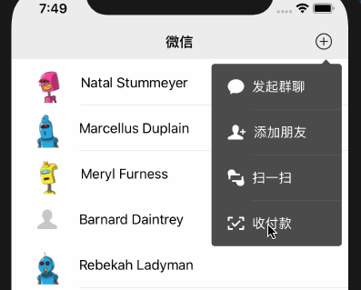

# WXNavigationBar
WeChat NavigationBar



# Requirements

- iOS 12.0+
- Xcode 11.0+
- Swift 5.0+

# Installation

WXNavigationBar is available through CocoaPods. To install it, simply add the following line to your Podfile:

```
pod 'WXNavigationBar'
```

# Usage

See the demo.

```swift
import WXNavigationBar

let controller = ViewController()
let nav = WXNavigationController(rootViewController: controller)
```

### Configuration

In your AppDelegate

```swift

import WXNavigationBar

WXNavigationBar.NavBar.backImage = UIImage(named: "xxx")
WXNavigationBar.NavBar.isShadowImageHidden = false

```


Scenario 1
---

Push to solid colored navigation bar

See `PaymentViewController` in the demo.

```swift
override var wx_navigationBarBackgroundColor: UIColor? {
    return UIColor(red: 67.0/255, green: 144.0/255, blue: 87.0/255, alpha: 1.0)
}
```


Scenario 2
--

Push to transparent navigation bar


See `MomentViewController` in the demo.

```swift

override func viewDidLoad() {
    super.viewDidLoad()
    
    // make the navigation bar transparent
    wc_navigationBar.alpha = 0
}

```

Scenario 3
--

Push to system navigation bar

See `ChatRoomViewController` in the demo.

```swift
override var wx_useSystemBlurNavBar: Bool {
    return true
}
```
